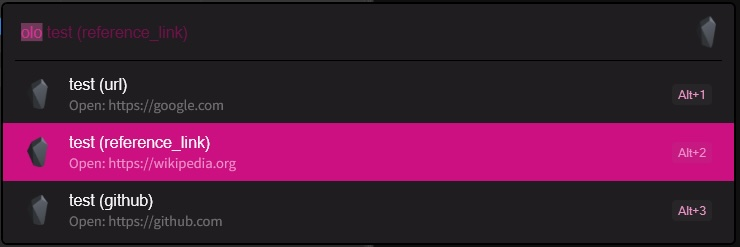

# Obsidian Link Opener for Flow Launcher

Raycastの「Obsidian Link Opener」にインスパイアされた、Obsidianノートのフロントマター（YAML）からURLを抽出し、Flow Launcherから直接ブラウザで開くためのプラグインです。



## ✨ 特徴

- **フロントマターからURLを自動抽出**: `url: https://...` や `link: https://...` などの形式に対応。
- **複数URLに対応**: 1つのノート内に複数のリンクがある場合、それらを個別にリストアップします。
- **高速検索**: ファイル名、URL、またはフロントマターのキー名で絞り込みが可能。
- **シンプル**: Obsidianを起動していなくても、URLを素早く開けます。

## 🚀 インストール方法

現在、本プラグインは手動インストールが必要です。

1. Flow Launcherで `UserData Folder` と入力して開き、`Plugins` フォルダへ移動します。
2. このリポジトリを `Plugins` フォルダ内にクローンするか、ZIPをダウンロードして展開します。
   ```bash
   cd %AppData%\FlowLauncher\Plugins
   git clone https://github.com/oganii/Flow.Launcher.ObsidianLinkOpener
   ```
3. `ObsidianLinkOpener` フォルダ内の `main.py` を開き、**`VAULT_PATH`** をご自身のObsidian保管庫（Vault）のパスに書き換えます。
   ```python
   VAULT_PATH = r"C:\Users\YourName\Documents\MyVault"
   ```
4. Flow Launcherを再起動します。

## 💡 使い方

1. Flow Launcherを起動し、キーワード `olo`（デフォルト）を入力します。
2. スペースに続けてノート名やURLの一部を入力して検索します。
3. `Enter` を押すと、ブラウザでURLが開きます。

### ノートの書き方の例
フロントマターに以下のように記述されているものが検索対象になります。

```yaml
---
title: My Cool Note
url: https://google.com
reference: https://github.com
---
```

## 🛠️ 設定

`plugin.json` を編集することで、起動キーワードを変更できます。

```json
"ActionKeyword": "olo"
```

## 📝 動作要件

- Windows 10/11
- [Flow Launcher](https://www.flowlauncher.com/)
- Python 3.x

## 📄 ライセンス

MIT License

---
